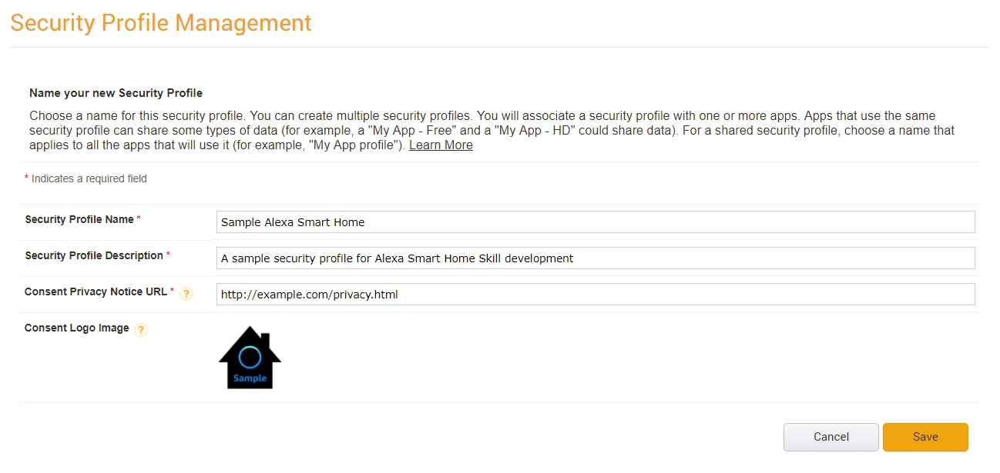
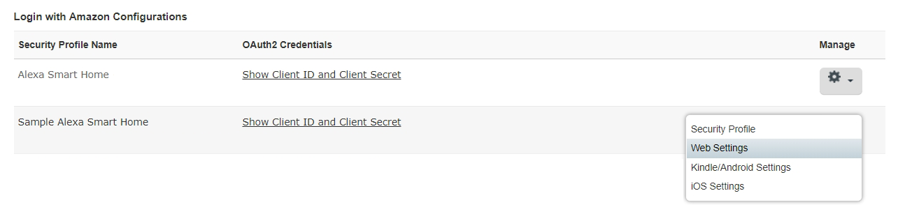

# Step 2: Set Up Login with Amazon
For the sample environment, a development Login with Amazon (LWA) security profile will be used for configuring Account Linking, which is required for a Smart Home Skill. 

#### <span style="color:#aaa">2.1</span> Create a Login with Amazon Security Profile

<span style="color:#ccc">2.1.1</span> In your web browser, go to https://developer.amazon.com/lwa/sp/overview.html and make sure _APPS & SERVICES_ is selected in the top menu and _Login with Amazon_ is selected in the sub menu.

<span style="color:#ccc">2.1.2</span> On the _Login with Amazon_ page, click the **Create a New Security Profile** button.

<span style="color:#ccc">2.1.3</span> On the Security Profile Management page, enter `Sample Alexa Smart Home` for the **Security Profile Name**.

<span style="color:#ccc">2.1.4</span> For the **Security Profile Description** enter `A sample security profile for Alexa Smart Home Skill development`.

<span style="color:#ccc">2.1.5</span> For the **Consent Privacy Notice URL** enter `http://example.com/privacy.html` for illustrative purposes or use your own if you already have a public consent privacy policy.

> For a production Smart Home Skill, a valid consent privacy notice will be required.

<span style="color:#ccc">2.1.6</span> For the **Consent Logo Image** download https://raw.githubusercontent.com/alexa/alexa-smarthome/master/sample_backend/docs/img/alexa-sample-smarthome-150x.png into the `Alexa-SmartHome-Sample` directory created on your Desktop and then click the **Upload Image** area to load the file from where you saved it.

<span style="color:#ccc">2.1.7</span> If your profile configuration looks like the following, click **Save** on the Security Profile Management page.




> If successful, a message similar to 'Login with Amazon successfully enabled for Security Profile. Click (gear) to manage Security Profile.' will be returned.

<span style="color:#ccc">2.1.8</span> From the list of Security Profiles, click the **Show Client ID and Client Secret** link for the _Sample Alexa Smart Home_ profile.

<span style="color:#ccc">2.1.9</span> Copy the displayed Client ID and Client Secret values to the `config.txt` file replacing the template entries for [Login with Amazon Client ID] and [Login with Amazon Client Secret] respectively:

```
[Login with Amazon Client ID]
amzn1.application-oa2-client.XXXXXXXXXXXXXXXXXXXXXXXXXXXXXXXX

[Login with Amazon Client Secret]
XXXXXXXXXXXXXXXXXXXXXXXXXXXXXXXXXXXXXXXXXXXXXXXXXXXXXXXXXXXXXXXX
```

<span style="color:#ccc">2.1.10</span> On the _Login with Amazon_ page, click the gear icon of the _Sample Alexa Smart Home_ profile and select **Web Settings** from the drop down menu. 




<span style="color:#ccc">2.1.11</span> On the Security Profile Management page for the _Sample Alexa Smart Home_ profile, click the **Edit** button.

<span style="color:#ccc">2.1.12</span> In the _Allowed Return URLs_ section click the **Add Another** link until there are 3 text input fields and then copy the following 3 URLs into each of the text fields.
```
https://pitangui.amazon.com/api/skill/link/M1PXZ4CXNJ6TU4
https://layla.amazon.com/api/skill/link/M1PXZ4CXNJ6TU4
https://alexa.amazon.co.jp/api/skill/link/M1PXZ4CXNJ6TU4
```

<span style="color:#ccc">2.1.13</span> When all fields are entered, click **Save**.

<span style="color:#ccc">2.1.14</span> Once saved, the _Allowed Return URLs_ section should look like the following:


<br>

____
Go to [Step 3: Create the Alexa Smart Home Skill](003-setup-create-skill-smarthome.md).
