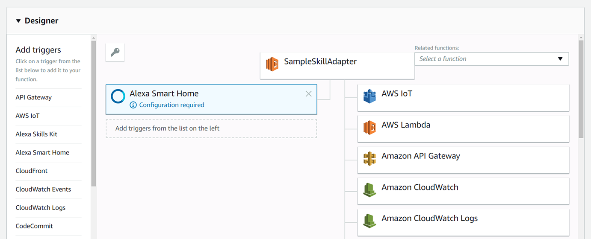

# Step 3: Create the Alexa Smart Home Skill
Create an Alexa Smart Home Skill that will process the Smart Home commands.

#### <span style="color:#aaa">3.1</span> Navigate to the Alexa Skills Kit developer console

<span style="color:#ccc">3.1.1</span> In a web browser to the Alexa Developer Console at [https://developer.amazon.com/alexa/console/ask](https://developer.amazon.com/alexa/console/ask). If not already authenticated, you may have to _Sign In_ with your Amazon Developer Account .

<span style="color:#ccc">3.1.2</span> From the _Alexa Skills_ page, click the **Create Skill** button on the top right of the page.

#### <span style="color:#aaa">3.2</span> Create a New Skill

<span style="color:#ccc">3.2.1</span> On the _Create a new skill_ page, enter `Sample Smart Home Skill` as the _Skill name_.

<span style="color:#ccc">3.2.2</span> Leave the language as English.

> For more information on adding another language to your skill, see [Develop Smart Home Skills in Multiple Languages](https://developer.amazon.com/docs/smarthome/develop-smart-home-skills-in-multiple-languages.html).


<span style="color:#ccc">3.2.3</span> Under _Choose a model to add to your skill_, select **Smart Home**.

<span style="color:#ccc">3.2.5</span> Click **Create a skill**

#### <span style="color:#aaa">3.3</span> Collect the Application Id of _Sample Smart Home Skill_

<span style="color:#ccc">3.3.1</span> When the skill is created, the page will refresh. In the _Smart Home service endpoint
_ section, copy the _Your Skill ID_ of the Alexa Skill to the `config.txt` file into the [Alexa Skill Application Id] value. The format of the Application Id will look like following:

```
amzn1.ask.skill.xxxxxxxx-xxxx-xxxx-xxxx-xxxxxxxxxxxx
```

<span style="color:#ccc">3.3.2</span> Copy the Application Id value to the clipboard.

#### <span style="color:#aaa">3.4</span> Add a Smart Home Trigger to the Alexa Smart Home Skill Lambda

<span style="color:#ccc">3.4.1</span> In a new tab, browse to https://us-east-1.console.aws.amazon.com/lambda/home?region=us-east-1#/functions/SampleSkillAdapter?tab=triggers.

<span style="color:#ccc">3.4.2</span> Note the **Add triggers** section on the left menu. This part of the designer allows you to add triggers to your Lambda function.


<span style="color:#ccc">3.4.3</span> In the _Configuration_ section, select **Alexa Smart Home** from the left menu and it should be added to the _SampleSkillAdapter_ as a trigger. The Alexa Smart Home trigger will report "Configuration required" until the corresponding Alexa Skill Application ID is entered as part of the configuration.



<span style="color:#ccc">3.4.4</span> Select the _Alexa Smart Home - Configuration required_ box and locate the _Configure triggers_ section at the bottom of the page. Paste the Alexa Skill Application Id value from the clipboard into the _Application Id_ text box. If you no longer have the value on your clipboard, you can retrieve it from the [Alexa Skill Application Id] section of the `config.txt` file.

<span style="color:#ccc">3.4.5</span> Verify **Enable trigger** is checked and then click **Add**. To finish enabling the trigger, click **Save** for the function at the top right of the page. Once saved, the Alexa Smart Home trigger should report "Saved".

<span style="color:#ccc">3.4.6</span> Close this tab and return to your _Sample Smart Home Skill_ in the [Alexa Developer Console](https://developer.amazon.com/alexa/console/ask).

<br>

____
Go to [Step 4: Configure the Alexa Smart Home Skill](004-setup-configure-skill-smarthome.md).
