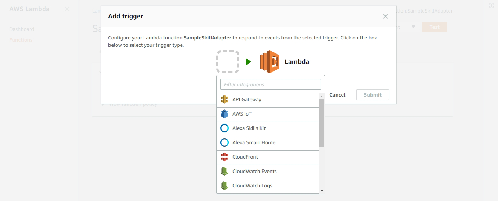

# Step 3: Create the Alexa Smart Home Skill
Create an Alexa Smart Home Skill that will process the Smart Home commands.

#### <span style="color:#aaa">3.1</span> Navigate to the Alexa Skills page

<span style="color:#ccc">3.1.1</span> In a web browser to the Amazon Developer Console at [https://developer.amazon.com/home.html](https://developer.amazon.com/home.html). If not already authenticated, you may have to _Sign In_ with your Amazon Developer Account . 

<span style="color:#ccc">3.1.2</span> Select the _Alexa_ tab from the top menu. 

<span style="color:#ccc">3.1.3</span> On the _Get started with Alexa_ page and in the _Alexa Skills Kit_ box, click the **Get Started >** button.

<span style="color:#ccc">3.1.4</span> From the _Building Alexa Skills with the Alexa Skills Kit_ page, click the **Add a New Skill** button on the top right of the page.

#### <span style="color:#aaa">3.2</span> Create a New Alexa Skill

<span style="color:#ccc">3.2.1</span> On the _Skill Information_ tab, from the **Skill Type** radio buttons select **Smart Home Skill API**

<span style="color:#ccc">3.2.2</span> Leave the language as English. 

> For more information on adding another language to your skill, see [Develop Smart Home Skills in Multiple Languages](https://developer.amazon.com/docs/smarthome/develop-smart-home-skills-in-multiple-languages.html).
 
<span style="color:#ccc">3.2.3</span> Enter `Sample Smart Home Skill` as the Name of the skill.

<span style="color:#ccc">3.2.4</span> Under Payload Version, verify **v3 (preferred)** is selected. 

<span style="color:#ccc">3.2.5</span> Click **Save**

#### <span style="color:#aaa">3.3</span> Collect the Application Id of _Sample Smart Home Skill_

<span style="color:#ccc">3.3.1</span> When the skill is saved, the page will refresh. From the refreshed skill information, copy the _Application Id_ of the Alexa Skill to the `config.txt` file into the [Alexa Skill Application Id] value. The format of the Application Id will look like following:

```
amzn1.ask.skill.xxxxxxxx-xxxx-xxxx-xxxx-xxxxxxxxxxxx
``` 

<span style="color:#ccc">3.3.2</span> Copy the Application Id value to the clipboard.

#### <span style="color:#aaa">3.4</span> Add a Smart Home Trigger to the Alexa Smart Home Skill Lambda

<span style="color:#ccc">3.4.1</span> In a new tab, browse to https://us-east-1.console.aws.amazon.com/lambda/home?region=us-east-1#/functions/SampleSkillAdapter?tab=triggers.

<span style="color:#ccc">3.4.2</span> Click the **+ Add trigger** button.

<span style="color:#ccc">3.4.3</span> In the _Add trigger_ dialog, click the empty box and then select **Alexa Smart Home** from the drop down menu.



<span style="color:#ccc">3.4.4</span> Paste the Alexa Skill Application Id value from the clipboard into the _Application Id_ text box. If you no longer have the value on your clipboard, you can retrieve it from the [Alexa Skill Application Id] section of the `config.txt` file.

<span style="color:#ccc">3.4.5</span> Verify **Enable trigger** is checked and then click **Submit**. If successful, a "Successfully added the trigger..." message will be returned.

<span style="color:#ccc">3.4.6</span> Close this tab and return to the _Sample Smart Home Skill_ in the Alexa Skills section of the Amazon Developer Console. 

<span style="color:#ccc">3.4.7</span> Click **Next** to move to the _Sample Smart Home Skill_ Interaction model and then click **Next** again to move to the Configuration section.

> TIP: If you need to return to the configuration page, you can replace SKILL_APPLICATION_ID in the following URL with your copied Application Id for a direct link.
> ```
> https://developer.amazon.com/edw/home.html#/skill/SKILL_APPLICATION_ID/en_US/configuration
> ```

<br>

____
Go to [Step 4: Configure the Alexa Smart Home Skill](004-setup-configure-skill-smarthome.md).
