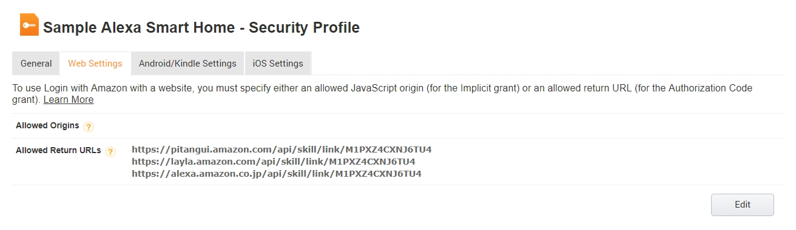

# Step 4: Configure the Alexa Smart Home Skill
Configure the Alexa Smart Home Skill that will process the Smart Home commands.

#### <span style="color:#aaa">4.1</span> Configure the Skill Endpoint

<span style="color:#ccc">4.1.1</span> Locate and copy the [SkillLambdaArn] from the `config.txt` file. It will have the following format: 

```
arn:aws:lambda:us-east-1:############:function:SampleSkillAdapter
```

<span style="color:#ccc">4.1.2</span> In the _Sample Smart Home Skill_ Configuration tab and in the **Global Fields** Endpoint section, paste the [SkillLambdaArn] value in the **Default** input box. 

<span style="color:#ccc">4.1.2</span> Click the **No** radio button for the **Provide geographical region endpoints?**.

#### <span style="color:#aaa">4.2</span> Configure the Skill Account Linking

<span style="color:#ccc">4.2.1</span> Further in the _Sample Smart Home Skill_ Configuration tab in the _Account Linking_ section enter `https://www.amazon.com/ap/oa` into the **Authorization URL** text box. 

<span style="color:#ccc">4.2.2</span> Set the Client Id value to the [Login with Amazon Client ID] from the `config.txt` file. It will have the following format:

```
amzn1.application-oa2-client.XXXXXXXXXXXXXXXXXXXXXXXXXXXXXXXX
```

<span style="color:#ccc">4.2.3</span> For the _Scope_, click the **Add scope** and then add the following scope into the text box `profile:user_id`

> For more details on what customer profile information is used, visit https://developer.amazon.com/docs/login-with-amazon/customer-profile.html

<span style="color:#ccc">4.2.4</span> Verify the **Authorization Grant Type** is set to **Auth Code Grant**.

<span style="color:#ccc">4.2.5</span> Set the Access Token URI to `https://api.amazon.com/auth/o2/token`

<span style="color:#ccc">4.2.6</span> Set the **Client Secret** field to the [Login with Amazon Client Secret] value from the `config.txt` file. It will look like the following example:
```
7ebd0170626aaa2c3df0e263bd3aa15553efe565d53d90bd88b1977387b1159c
```

#### <span style="color:#aaa">4.3</span> Configure the Skill Permissions

<span style="color:#ccc">4.3.1</span> Check **Send Alexa Events**

> TIP: This value needs to be checked and enables the operation of asynchronous messages and proactive state updates.


#### <span style="color:#aaa">4.4</span> Set the Skill Privacy Policy URL
<span style="color:#ccc">4.4.1</span> For the required **Privacy Policy URL** enter `http://example.com/privacy.html` for illustrative purposes or use your own if you already have a public privacy policy.

<span style="color:#ccc">4.4.2</span> Click **Save**. This will refresh the page and, if successful, an **Alexa Skill Messaging** section will be added to the _Permissions_ group.


#### <span style="color:#aaa">4.5</span> Collect the Messaging Client ID and Client Secret
<span style="color:#ccc">4.5.1</span> From _Permissions_ group and in the **Alexa Skill Messaging** section, click the _Show_ link to expose the Client Secret and then copy the **Client ID** and **Client Secret** to the [Alexa Skill Messaging Client Id] and [Alexa Skill Messaging Client Secret] sections `config.txt` file.

<span style="color:#ccc">4.5.2</span> Save the values into the `config.txt` file in the , click [Alexa Skill Messaging Client Id] and [Alexa Skill Messaging Client Secret] sections.

```
[Alexa Skill Messaging Client Id]
amzn1.application-oa2-client.XXXXXXXXXXXXXXXXXXXXXXXXXXXXXXXX

[Alexa Skill Messaging Client Secret]
XXXXXXXXXXXXXXXXXXXXXXXXXXXXXXXXXXXXXXXXXXXXXXXXXXXXXXXXXXXXXXXX
```

#### <span style="color:#aaa">4.6</span> Set the Allowed Return URLs
Using your account-specific values from the skill configuration section, collect the Redirect URLs and set them in the _Security Profile Web Settings_ **Allowed Return URLs**.

<span style="color:#ccc">4.6.1</span> While on the security configuration page, locate the Returned Urls section. That section should have values that look like the following format:

```
https://pitangui.amazon.com/api/skill/link/XXXXXXXXXXXXXX
https://layla.amazon.com/api/skill/link/XXXXXXXXXXXXXX
https://alexa.amazon.co.jp/api/skill/link/XXXXXXXXXXXXXX
```
> These values will be copied into the previously Security Profile, so leave the Alexa skill configuration tab open.

<span style="color:#ccc">4.6.2</span> Open [https://developer.amazon.com/iba-sp/overview.html](https://developer.amazon.com/iba-sp/overview.html) in another browser tab and make sure _APPS & SERVICES_ is selected in the top menu and _Security Profiles_ is selected in the sub menu.

<span style="color:#ccc">4.6.3</span> On the _Security Profile Management_ page, click the **Sample Alexa Smart Home** profile.

<span style="color:#ccc">4.6.4</span> In the details for the _Sample Alexa Smart Home - Security Profile_ click the **Web Settings** top tab menu.

<span style="color:#ccc">4.6.5</span> On the Security Profile Management page for the _Sample Alexa Smart Home_ profile, click the **Edit** button.

<span style="color:#ccc">4.6.6</span> In the _Allowed Return URLs_ section click the **Add Another** link until there are 3 text input fields.

<span style="color:#ccc">4.6.7</span> Copy each of the 3 URLs from the Alexa skill configuration page into each of the text fields.

<span style="color:#ccc">4.6.8</span> When all fields are entered, click **Save**.

<span style="color:#ccc">4.6.9</span> Once saved, the _Allowed Return URLs_ section should look something like the following:



<span style="color:#ccc">4.6.10</span> Close the _Security Profile Management_ tab and return to the Alexa skill configuration.

#### <span style="color:#aaa">4.7</span> Step through the Alexa skill Test section
Make no changes to the _Test_ tab of the Alexa _Sample Smart Home Skill_.

<span style="color:#ccc">4.7.1</span> From the Alexa skill configuration page and while still on the _Configuration_ tab, click **Next** to move to the _Test_ tab.

<span style="color:#ccc">4.7.2</span> Click **Next** again when on the _Test_ tab.

#### <span style="color:#aaa">4.6</span> Set the Skill Publishing Information
<span style="color:#ccc">4.6.1</span> On the _Publishing Information_ tab and in the **Testing Instructions** text field enter `This is a sample skill for Alexa Smart Home intended for development use.`.

<span style="color:#ccc">4.6.2</span> For the **Short Skill Description**, enter `Sample Smart Home Skill`.

<span style="color:#ccc">4.6.3</span> In the **Full Skill Description** enter `This is a sample skill for Alexa Smart Home intended for development use.`.

<span style="color:#ccc">4.6.4</span> In the **Example Phrases** section enter the following one per line:

```
Alexa, turn on Black Switch
Alexa, turn off Black Switch
Alexa, turn on White Switch
```

<span style="color:#ccc">4.6.5</span> For the **Small Icon** image, download https://raw.githubusercontent.com/alexa/alexa-smarthome/master/sample_backend/docs/img/alexa-sample-smarthome-108x.png into the `Alexa-SmartHome-Sample` directory created on your Desktop and then click the _Upload Image_ icon to load the file from where you saved it.

<span style="color:#ccc">4.6.6</span> For the **Large Icon** image, download https://raw.githubusercontent.com/alexa/alexa-smarthome/master/sample_backend/docs/img/alexa-sample-smarthome-512x.png into the `Alexa-SmartHome-Sample` directory created on your Desktop and then click the _Upload Image_ icon to load the file from where you saved it.

<span style="color:#ccc">4.6.7</span> Click **Next**.

#### <span style="color:#aaa">4.7</span> Set the Privacy & Compliance values

<span style="color:#ccc">4.7.1</span> Answer No for each of the questions in _Privacy_ section.

<span style="color:#ccc">4.7.2</span> In the _Compliance_ section, check the **Export Compliance** box and answer No to the **Does this skill contain advertising?** question.  

> TIP: For a production application, verify these answers with the responsible parties inside your organization.

<span style="color:#ccc">4.7.3</span> Click **Save**.

> <span style="color:#red">Do NOT click **Submit for certification** for this sample application</span>


<br>

____
Go to [Step 5: Link the Alexa Smart Home Skill](005-setup-link-skill-smarthome.md).
