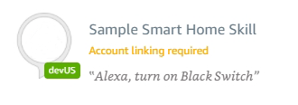
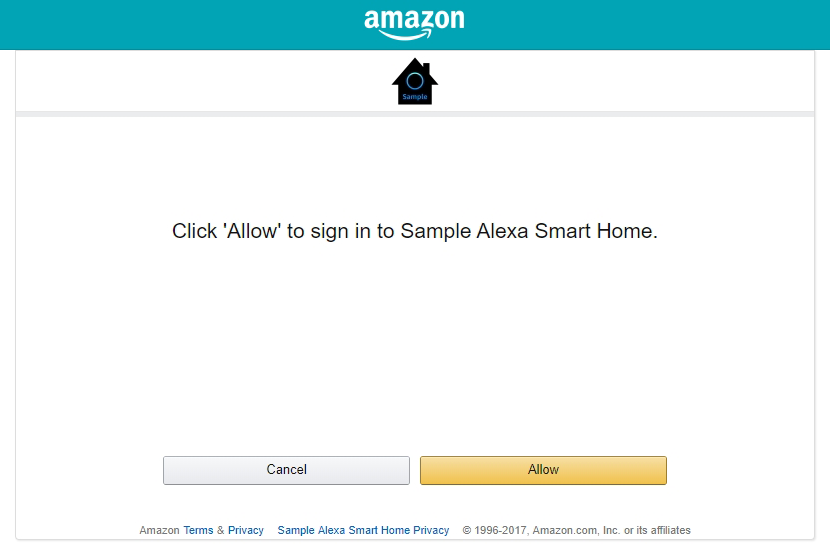

# Step 5: Link the Alexa Smart Home Skill
Finalize the Lambda configuration and link the Alexa Smart Home Skill to your account.

#### 5.1 Update the Skill Lambda Environment variables
With a completed Alexa Smart Home Skill configuration, the Alexa Skill Client ID and Client Secret will need to be passed to the backend. To accomplish this, you can set the environment variables of the Lambda that is handling the Endpoint interactions.

5.1.2 Browse to https://us-east-1.console.aws.amazon.com/lambda/home?region=us-east-1#/functions/SampleEndpointAdapter?tab=configuration.

5.1.3 Expand the **Environment variables** section add a Key called `client_id`.

5.1.4 For the _client\_id_ value enter the value stored in [Alexa Skill Messaging Client Id] from the `config.txt` file.

5.1.5 In the **Environment variables** section add another Key called `client_secret`.

5.1.6 For the _client\_secret_ value enter the value stored in [Alexa Messaging Skill Client Secret] from the `config.txt` file.

5.1.7 When both the _client\_id_ and _client\_secret_ environment variables are added, click **Save** at the top of the page.

#### 5.2 Link the Alexa Smart Home Skill

5.2.1 Go to https://alexa.amazon.com/ and select **Skills** from the left menu.

> Tip: Replace the skill value at the end of https://alexa.amazon.com/spa/index.html#skills/beta/ALEXA_SKILL_ID to go directly to a skill.
> For example, https://alexa.amazon.com/spa/index.html#skills/beta/amzn1.ask.skill.203e1508-e33b-4b63-8e0e-70b97e45408d

5.2.2 Click **Your Skills** from the top right of the section.

5.2.3 Locate your Sample Smart Home Skill in the list of skills in the _DEV SKILLS_ section and click on it.

5.2.4 On the _Sample Smart Home Skill_ page, click **Enable** in the top right and authenticate with your Amazon account.

5.2.5 On authentication, verify you are presented with the _Sample Alexa Smart Home_ authentication dialog and authenticate using your Amazon account. The transitional page will look something like the following in a browser:

5.2.6 Click **Allow** to link your Account with the _Sample Alexa Smart Home_ skill.

5.2.7 On success, you should be presented with a window that instructing you to close the page and return to the _Sample Smart Home Skill_.

5.2.8 When redirected back to the Skill page, you will be prompted 'Discover Devices'. Click **Cancel**  for now as no new devices from the Sample Smart Home Skill will be returned without additional configuration.

 

____
Go to [Step 6: Create the Endpoints](006-setup-create-endpoints.md).
