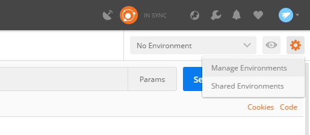
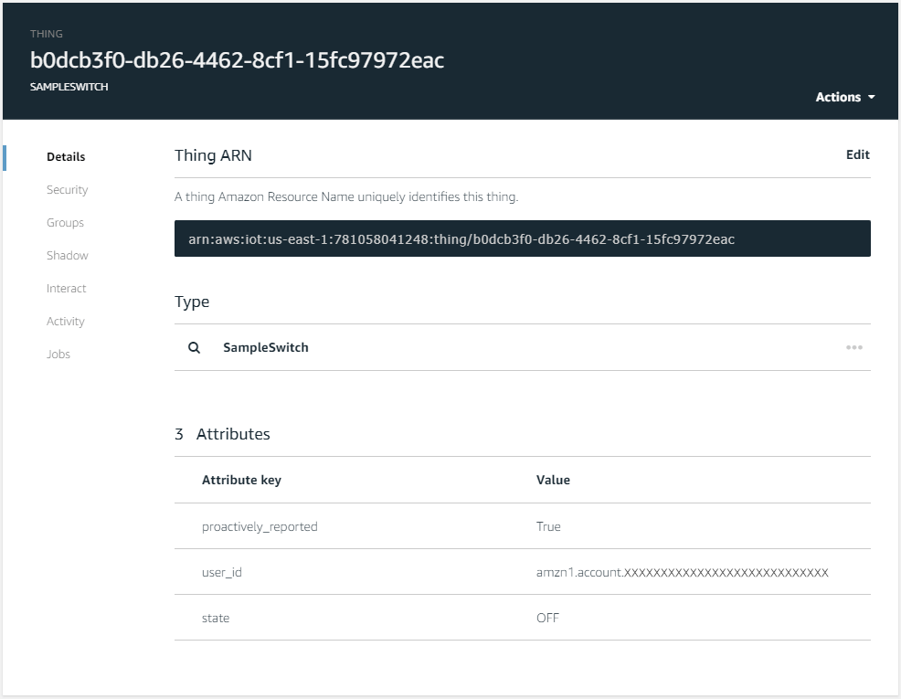

# Step 6: Create the Endpoints
Create endpoints to be discovered during the Alexa Smart Home Skill Discovery.

#### <span style="color:#aaa">6.1</span> Collect the User Id
The JSON template for creating an endpoint defaults the User Id to `0`. This is useful for testing simulated calls to your AWS Lambda for a variety of directives with a known (invalid) User Id. To associate the device with an actual Amazon account, the correct User Id obtained with the access token must be used. During skill enablement, the credentials are saved to DynamoDB into the SampleUsers table for reference.
> The credentials in the SampleUsers table are for development reference only and should be stored securely in a production environment.

<span style="color:#ccc">6.2.1</span> Go to https://console.aws.amazon.com/dynamodb/home?region=us-east-1#tables:selected=SampleUsers and select the **Items** tab.

<span style="color:#ccc">6.2.2</span> In the list of _SampleUsers_ select the first entry UserId column that has the following format:
```
amzn1.account.XXXXXXXXXXXXXXXXXXXXXXXXXXXX
```
<span style="color:#ccc">6.2.3</span> Copy the UserId value and save it to the [user_id] section of the `config.txt` file. The User Id is used to identify devices associated with the Amazon account.

#### <span style="color:#aaa">6.2</span> Set Up Postman
Postman is a tool for managing and executing HTTP requests and is very useful for API development and usage. To use it for the sample code, it must first be installed if not currently available on your system and have a sample environment configured for use.

##### <span style="color:#aaa">6.2.1</span> Install Postman
<span style="color:#ccc">6.2.1</span> Go to [getpostman.com](https://www.getpostman.com) and download and install the correct Postman application for your platform.

<span style="color:#ccc">6.2.2</span> Download the Postman Sample Smart Home Collection from https://raw.githubusercontent.com/alexa/alexa-smarthome/master/sample_backend/lambda/lambda_api/sample_backend.postman_collection.json into the `Alexa-SmartHome-Sample` directory on your Desktop.

##### <span style="color:#aaa">6.2.2</span> Import the *Alexa Smart Home (sample\_backend)* Postman collection

<span style="color:#ccc">6.2.2.1</span> Open Postman.

<span style="color:#ccc">6.2.2.2</span> In Postman, click **Import** from the main menu and browse to the `sample_backend.postman_collection.json` file or drag it onto the _Import_ dialog.

##### <span style="color:#aaa">6.2.3</span> Create a Postman environment
To fill out the variable values of the configuration use a Postman environment to store configuration-specific values. The keys defined in double curly braces like `{{endpoint_api_id}}` will be auto-expanded in the URLs for the imported collection.

<span style="color:#ccc">6.2.3.1</span> In the top right of Postman, click the gear icon to open the _Environment options_ drop down menu and select **Manage Environments**.



<span style="color:#ccc">6.2.3.2</span> In opened _MANAGE ENVIRONMENTS_ dialog, click the **Add** in the bottom right.

<span style="color:#ccc">6.2.3.3</span> For the _Environment Name_ enter `Alexa Smart Home (sample_backend)`.

<span style="color:#ccc">6.2.3.4</span> Add a **Key** value called  `aws_region` and set its **Value** to `us-east-1`.

<span style="color:#ccc">6.2.3.5</span> Add another **Key** value called  `endpoint_api_id` and set its **Value** to the [EndpointApiId] value from the `config.txt` file.

<span style="color:#ccc">6.2.3.6</span> Click the **Add** button again to save the environment settings.

<span style="color:#ccc">6.2.3.7</span> Close the _MANAGE ENVIRONMENTS_ dialog and in the top right of Postman select the newly created *Alexa Smart Home (sample\_backend)* environment from the  environment drop down menu.


#### <span style="color:#aaa">6.3</span> Create Endpoints
Use Postman to generate endpoints by selecting and sending stored requests from the Alexa Smart Home (sample_backend) collection.

<span style="color:#ccc">6.3.1</span> In Postman, from the left _Collections_ menu select and open the *Alexa Smart Home (sample\_backend)* folder. In the *Endpoints* sub-folder, open the **POST** _/endpoints (Sample Black Switch)_ resource from the left menu.

<span style="color:#ccc">6.3.2</span> In Postman, select the **POST** _/endpoints (Sample Black Switch)_ resource from the left menu and then select the Body tab to show the raw body that would be sent from this request.


<span style="color:#ccc">6.3.3</span> In the JSON in the _raw_ section, replace the `userId` value (with a default of `0`) with your User Id from the config.txt file. This will associate the created thing with an Amazon account for device discovery.

> Note that the user_id defaults to 0 because this is useful for development and identifying a device created programmatically. However, Discovery for the Smart Home Skill would not find this device since it is expecting a user_id in the form of a profile from Login with Amazon.

<span style="color:#ccc">6.3.4</span> Once you have added your User Id value, click the **Send** button in the top right to send and create the endpoint.

<span style="color:#ccc">6.3.5</span> Return to the [AWS IoT Things console](https://console.aws.amazon.com/iotv2/home?region=us-east-1#/thinghub) and refresh the page. A new thing of the type `SAMPLESWITCH` should be available. It's name will be a generated GUID.

<span style="color:#ccc">6.3.6</span> Click on the thing identified with a thing type of `SAMPLESWITCH` to inspect its attributes. They should look something like the following:



The Globally Unique ID (GUID) representing the name of this device will correspond to an entry in the **SampleEndpointDetails** table that holds the details of the device for discovery. You can browse to the [SampleEndpointDetails DynamoDB Table](https://console.aws.amazon.com/dynamodb/home?region=us-east-1#tables:selected=SampleEndpointDetails) and view the items entry to see the details stored in AWS.

With this Sample Switch Thing defined in the account you are using for Alexa, you should now be able to discover it as a virtual device.

> If you want to create other devices, look at the other options in the samples provided in the Postman collection and update the userId value in the POST body of the resource. Click **Send** to POST it to the endpoint API

<br>

____
Go to [Step 7: Test the Endpoints](007-setup-test-endpoints.md).
